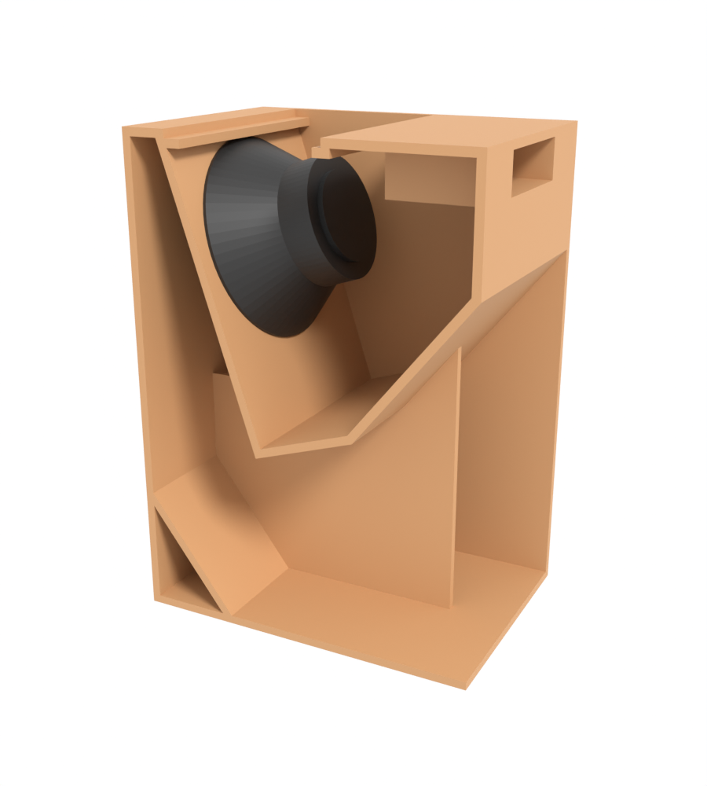
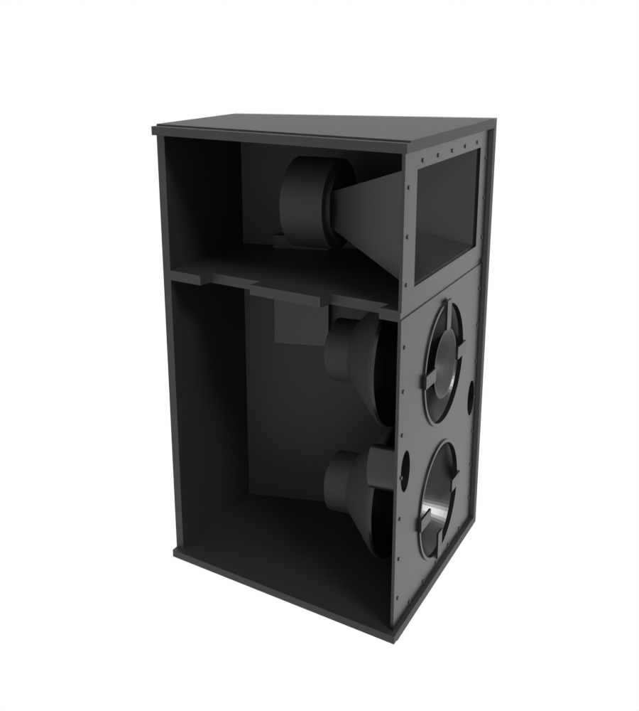

# Standalone models

Single loudspeakers modelled by hand rather than generated from a spec, for people who asked for a file to open in
Blender. They are not part of the gear catalogue, have no spec under `specs/` and never appear in a scene. Each one is
built by its own script under [`blender/standalone/`](../blender/standalone/) and kept the sdwa5-3d way: metres, +Z up,
front faces −Y, origin at the bottom centre. So it drops into a scene next to the library's cabinets at true scale.

**These are the one binary output this repository commits.** Everything under `build/` is regenerated on demand, but
these files are the deliverable itself, and somebody who wants one should not need ddev and Blender to get it.

| Model | Type | W × H × D (m) | Basis | Files |
|-------|------|---------------|-------|-------|
| [THA 15″ Fighter horn](tha-fighter-horn-15/) | folded front-loaded horn sub, one 15″ | 0.450 × 0.873 × 0.630 | plans | `.blend`, `.glb`, two previews |
| [Community RS660](community-rs660/) | three-way trapezoid top, 1995 | 0.514 × 0.857 × 0.514 | data sheet | `.blend`, `.glb`, three previews |

Inside each `.blend` a text block named `README` lists every dimension with its basis: **D** for a figure printed on
the source, **S** for one scaled off its drawing, **E** for an estimate. The same table heads each build script.

## THA 15″ Fighter horn



Source: the plan *15 THA Fighter Horn*, side section and front view,
<https://lh6.googleusercontent.com/-wRB8_m2lDl0/T2tDNvZ44JI/AAAAAAAABK0/dGQQE8Lo8m8/s1024/15%2520fighter.jpg>,
and the [build thread](https://www.freespeakerplans.com/kunena/15-sub-bass/17435-my-fighter-horn-built?start=10).
Every panel is 15 mm and every panel position is dimensioned on the plan. Estimated are the port tunnel's side walls,
the top opening's exact span and the driver, a generic rear-mounted 15″ whose frame is reduced to 363 mm so that it
clears the hatch cleat. A real 15″ frame of about 387 mm would touch it.

## Community RS660



Source: the Community data sheet *RS660 Three-way electronically controlled loudspeaker system* (1995),
<https://downloads.biamp.com/assets/docs/default-source/discontinued/biamp_data_sheets_community_rs660_jun21.pdf>.
The outside is the data sheet's: 514 × 857 × 514 mm, a 310 mm back, four steel edges and four handles. The faceplate
openings, ports, straps, screws, handles and bolts are scaled off its front and side drawings. Estimated is everything
behind the faceplate, which the data sheet does not show: the horn depths, the port depth, the drivers, 18 mm walls,
the 3 mm steel and a shelf between the mid and the LF section that the faceplate's strip implies.

The build prints the modelled LF chamber against the 98 L the data sheet states. It comes to about 87.5 L, so the
shelf position or the depths behind the faceplate are somewhat off. The outside is not affected.

## Rebuilding

```bash
ddev exec blender -b --factory-startup --python blender/standalone/build_tha_fighter_15.py -- --out standalone/tha-fighter-horn-15
ddev exec blender -b --factory-startup --python blender/standalone/build_community_rs660.py -- --out standalone/community-rs660
python3 tools/check-glb.py 'standalone/*/*.glb'
```

Each build asserts that every part is a closed solid and that the union is the declared box, and it writes the
same `sdwa5_metadata` a generated model carries, so `tools/check-glb.py` checks both alike. `StandaloneModelsTest`
reads the committed `.glb` files on every `composer test`.

## Checking against the drawings

The drawings the models were traced from are third-party and are not committed, neither as files nor packed into a
committed `.blend`. `--ref <dir>` brings them back for a check: the build then packs them as half-transparent,
true-scale image empties into the `Reference` collection and renders ortho views of the model into the same directory,
for an overlay. Write such a build to a scratch directory, never over the committed files.

```bash
# RS660: both data sheet pages at 400 dpi, then 1 px = 1 mm crops
pdftoppm -r 400 -png biamp_data_sheets_community_rs660_jun21.pdf page
ffmpeg -i page-1.png -vf "crop=664:1118:1833:625,scale=514:857:flags=area,format=gray" front-ref.png
ffmpeg -i page-2.png -vf "crop=395:659:1904:1495,scale=514:857:flags=area,format=gray" side-ref.png

# Fighter: the side section out of the plan image
ffmpeg -i 15-fighter.jpg -vf "crop=535:650:0:55" side-view.png
```

## Licence

The designs belong to their authors, the Fighter to its plan's author and the RS660 to Community Professional
Loudspeakers. What is ours is the modelling, and it is under CC BY-SA 4.0 like the rest of this repository's data.
